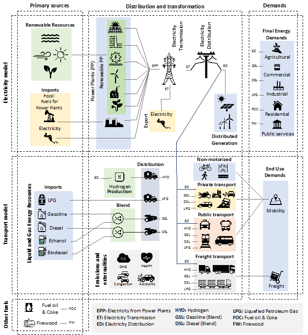

# Summary

Costa Rica has excelled for nature protection and leadership to fight climate change. 
With an almost 100% renewable electricity matrix and forest coverage of approximately 60%, 
the country is moving toward the transformation of the transport sector as the third major step towards decarbonisation. 
This sector represents 44% of the total Greenhouses Gases (GHG) emission of the country. 
In this context, the University of Costa Rica, The Royal Institute of Technology, and the Climate Change Directorate developed 
``OSeMOSYS-CR`` to support national energy-related climate change policy. 
This work emerged as part of the Deep Decarbonisation Pathways Project in Latin America and the Caribbean (DDPP-LAC), 
which is coordinated by the Institute for Sustainable Development and International Relations (IDDRI) and the Inter-American Development Bank (IADB) [@IDB2019]. 
As a result, the model helped to formulate and analyze the National Decarbonisation Plan of Costa Rica (NDP) [@MINAE2019], 
which is the long-term low-level GHG strategy of the country, representing an advance in terms of transparency and the decision-making process.

``OSeMOSYS-CR`` is an Energy System Optimization Model (ESOM) based on Open Source Energy Modelling System (OSeMOSYS) [@HOWELLS20115850;@GARDUMI2018209] that follows a bottom-up 
approach to establishing the most cost-effective technological transitions towards a deep decarbonisation in the energy sector. 
The model has a particular attention to transportation (mobility and cargo) and its relation with the power grid and alternatives energy carriers, 
which are crucial for understanding the technological transition to reach zero emissions by 2050. The model was built on a countrywide scale 
considering the effect of rainy and dry months and including the entire process from energy sources supply to demands. The whole composition was 
based on the best available data and selecting control variables to monitor the reliability of the model, such as the sale of fossil fuels and 
electricity or the relation between the average distance traveled and energy consumption for the transport sector.

The model combines more than one hundred commodities and two hundred technologies. Figure 1 presents a simple representation of the model, 
including primary energy supply (i.e., renewable, fossil fuel imports, biomass, and electricity imports), groups of technologies 
(i.e., power plants, vehicles, and distribution systems), energy demands by sector (i.e., industrial, residential, commercial and agricultural) 
and transport requirements (i.e., passenger and cargo). Furthermore, a module for co-benefits related to the activity of fossil fuels calculates 
the effects on health, congestion, and the number of accidents. The entire composition of the model incorporated the best available data and 
selecting control variables to monitor the reliability of the model, such as the sale of fossil fuels and electricity or the relation 
between the average distance traveled and energy consumption for the transport sector. The parametrization of technologies includes costs, emissions, 
activity level, and capacities, according to their characteristics. Documentation of these parameters is available in the repository.  

# Figures

Figures can be included like this: 

# Acknowledgements

We acknowledge contributions from Brigitta Sipocz, Syrtis Major, and Semyeong
Oh, and support from Kathryn Johnston during the genesis of this project.

# References
